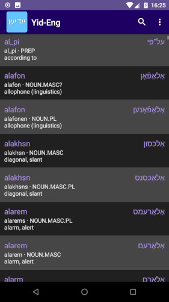
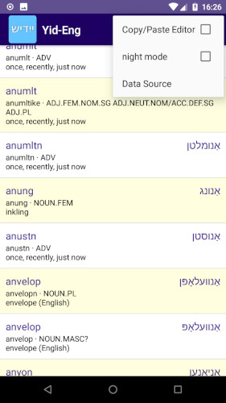
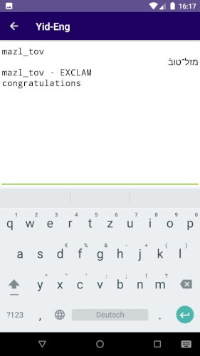

# Yid-Eng

A very simple Yiddish to English dictionary app. First start of the App takes about 10 seconds.

Features:

 -  works offline
 -  very simple
 -  nightmode
 -  search and highlight results
 -  click to copy entry to clipboard OR
 -  ... use a Copy-Paste "editor" window

## Hack the content

The App does a trick: the basic `csv` file is exported to `Documents/de.digisocken.yid2eng/wordlist.csv`
on your Android device. The file is big, but with a simple layout:

- lines with a \# hashtag will be ignored
- a line has 5 parts: **PART 1,PART 2,PART 3,PART 4,PART 5**
- The 5th part additionally uses "quotation marks" in order to be able to separate there also with comma or semicolons.

The App dislays the content as follows:

- part 1: main hit (bold, left side)
- part 3: hit in yiddish (bold, right side)
- part 2 and 4: additional content with romanized transliteration and gramatic information
- part 5: seperat content line with english translation or other details

After a new start of the App, changes to the file are read in.
If the file is deleted, it will be restored with default values.

## Get the App

You can get a signed APK from here (Android 4.1+): [APK](https://raw.githubusercontent.com/no-go/Yid2Eng/master/app/release/de.digisocken.yid2eng.apk)

## Screenshots

Nightmode

Search with YIVO transcription yiddish and english words.

Menu with link to Data Source - the online dictionary.

Text mode for easy copy-paste an entry.

Search with hebrew letters.

## Privacy Policy

### Personal information.

Personal information is data that can be used to uniquely identify or contact a single person. I DO NOT collect, transmit, store or use any personal information while you use this app.

### Non-Personal information.

I DO NOT collect non-personal information like user's behavior:

 -  to solve App problems
 -  to show personalized ads

The google play store collect non-personal information such as the data of install (country and equipment).

### Privacy Questions.

If you have any questions or concerns about my Privacy Policy or data processing, please contact me.

## License - My Android Code

This is free and unencumbered software released into the public domain.

Anyone is free to copy, modify, publish, use, compile, sell, or distribute this software, either in source code form or as a compiled binary, for any purpose, commercial or non-commercial, and by any means.

In jurisdictions that recognize copyright laws, the author or authors of this software dedicate any and all copyright interest in the software to the public domain. We make this dedication for the benefit of the public at large and to the detriment of our heirs and successors. We intend this dedication to be an overt act of relinquishment in perpetuity of all present and future rights to this software under copyright law.

THE SOFTWARE IS PROVIDED "AS IS", WITHOUT WARRANTY OF ANY KIND, EXPRESS OR IMPLIED, INCLUDING BUT NOT LIMITED TO THE WARRANTIES OF MERCHANTABILITY, FITNESS FOR A PARTICULAR PURPOSE AND NONINFRINGEMENT. IN NO EVENT SHALL THE AUTHORS BE LIABLE FOR ANY CLAIM, DAMAGES OR OTHER LIABILITY, WHETHER IN AN ACTION OF CONTRACT, TORT OR OTHERWISE, ARISING FROM, OUT OF OR IN CONNECTION WITH THE SOFTWARE OR THE USE OR OTHER DEALINGS IN THE SOFTWARE.

For more information: http://unlicense.org

## License - worldlist.csv

 The worldlist.csv is licensed under a <a rel="license" href="http://creativecommons.org/licenses/by-nc/3.0/us/">Creative Commons Attribution-NonCommercial 3.0 United States License</a>.

THE WORK (AS DEFINED BELOW) IS PROVIDED UNDER THE TERMS OF THIS CREATIVE COMMONS PUBLIC LICENSE ("CCPL" OR "LICENSE"). THE WORK IS PROTECTED BY COPYRIGHT AND/OR OTHER APPLICABLE LAW. ANY USE OF THE WORK OTHER THAN AS AUTHORIZED UNDER THIS LICENSE OR COPYRIGHT LAW IS PROHIBITED.

BY EXERCISING ANY RIGHTS TO THE WORK PROVIDED HERE, YOU ACCEPT AND AGREE TO BE BOUND BY THE TERMS OF THIS LICENSE. TO THE EXTENT THIS LICENSE MAY BE CONSIDERED TO BE A CONTRACT, THE LICENSOR GRANTS YOU THE RIGHTS CONTAINED HERE IN CONSIDERATION OF YOUR ACCEPTANCE OF SUCH TERMS AND CONDITIONS.

### 1. Definitions

 -  a) **Collective Work** means a work, such as a periodical issue, anthology or encyclopedia, in which the Work in its entirety in unmodified form, along with one or more other contributions, constituting separate and independent works in themselves, are assembled into a collective whole. A work that constitutes a Collective Work will not be considered a Derivative Work (as defined below) for the purposes of this License.
 -  b) **Derivative Work** means a work based upon the Work or upon the Work and other pre-existing works, such as a translation, musical arrangement, dramatization, fictionalization, motion picture version, sound recording, art reproduction, abridgment, condensation, or any other form in which the Work may be recast, transformed, or adapted, except that a work that constitutes a Collective Work will not be considered a Derivative Work for the purpose of this License. For the avoidance of doubt, where the Work is a musical composition or sound recording, the synchronization of the Work in timed-relation with a moving image ("synching") will be considered a Derivative Work for the purpose of this License.
 -  c) **Licensor** means the individual, individuals, entity or entities that offers the Work under the terms of this License.
 -  d) **Original Author** means the individual, individuals, entity or entities who created the Work.
 -  e) **Work** means the copyrightable work of authorship offered under the terms of this License.
 -  f) **You** means an individual or entity exercising rights under this License who has not previously violated the terms of this License with respect to the Work, or who has received express permission from the Licensor to exercise rights under this License despite a previous violation.

### 2. Fair Use Rights

Nothing in this license is intended to reduce, limit, or restrict any rights arising from fair use, first sale or other limitations on the exclusive rights of the copyright owner under copyright law or other applicable laws.

### 3. License Grant

Subject to the terms and conditions of this License, Licensor hereby grants You a worldwide, royalty-free, non-exclusive, perpetual (for the duration of the applicable copyright) license to exercise the rights in the Work as stated below:

 -  a) to reproduce the Work, to incorporate the Work into one or more Collective Works, and to reproduce the Work as incorporated in the Collective Works;
 -  b) to create and reproduce Derivative Works provided that any such Derivative Work, including any translation in any medium, takes reasonable steps to clearly label, demarcate or otherwise identify that changes were made to the original Work. For example, a translation could be marked "The original work was translated from English to Spanish," or a modification could indicate "The original work has been modified.";
 -  c) to distribute copies or phonorecords of, display publicly, perform publicly, and perform publicly by means of a digital audio transmission the Work including as incorporated in Collective Works;
 -  d) to distribute copies or phonorecords of, display publicly, perform publicly, and perform publicly by means of a digital audio transmission Derivative Works;

The above rights may be exercised in all media and formats whether now known or hereafter devised. The above rights include the right to make such modifications as are technically necessary to exercise the rights in other media and formats. All rights not expressly granted by Licensor are hereby reserved, including but not limited to the rights set forth in Sections 4(d) and 4(e).

### 4. Restrictions

The license granted in Section 3 above is expressly made subject to and limited by the following restrictions:

 -  a) You may distribute, publicly display, publicly perform, or publicly digitally perform the Work only under the terms of this License, and You must include a copy of, or the Uniform Resource Identifier for, this License with every copy or phonorecord of the Work You distribute, publicly display, publicly perform, or publicly digitally perform. You may not offer or impose any terms on the Work that restrict the terms of this License or the ability of a recipient of the Work to exercise the rights granted to that recipient under the terms of the License. You may not sublicense the Work. You must keep intact all notices that refer to this License and to the disclaimer of warranties. When You distribute, publicly display, publicly perform, or publicly digitally perform the Work, You may not impose any technological measures on the Work that restrict the ability of a recipient of the Work from You to exercise the rights granted to that recipient under the terms of the License. This Section 4(a) applies to the Work as incorporated in a Collective Work, but this does not require the Collective Work apart from the Work itself to be made subject to the terms of this License. If You create a Collective Work, upon notice from any Licensor You must, to the extent practicable, remove from the Collective Work any credit as required by Section 4(c), as requested. If You create a Derivative Work, upon notice from any Licensor You must, to the extent practicable, remove from the Derivative Work any credit as required by Section 4(c), as requested.
 -  b) You may not exercise any of the rights granted to You in Section 3 above in any manner that is primarily intended for or directed toward commercial advantage or private monetary compensation. The exchange of the Work for other copyrighted works by means of digital file-sharing or otherwise shall not be considered to be intended for or directed toward commercial advantage or private monetary compensation, provided there is no payment of any monetary compensation in connection with the exchange of copyrighted works.
 -  c) If You distribute, publicly display, publicly perform, or publicly digitally perform the Work (as defined in Section 1 above) or any Derivative Works (as defined in Section 1 above) or Collective Works (as defined in Section 1 above), You must, unless a request has been made pursuant to Section 4(a), keep intact all copyright notices for the Work and provide, reasonable to the medium or means You are utilizing: (i) the name of the Original Author (or pseudonym, if applicable) if supplied, and/or (ii) if the Original Author and/or Licensor designate another party or parties (e.g. a sponsor institute, publishing entity, journal) for attribution ("Attribution Parties") in Licensor's copyright notice, terms of service or by other reasonable means, the name of such party or parties; the title of the Work if supplied; to the extent reasonably practicable, the Uniform Resource Identifier, if any, that Licensor specifies to be associated with the Work, unless such URI does not refer to the copyright notice or licensing information for the Work; and, consistent with Section 3(b) in the case of a Derivative Work, a credit identifying the use of the Work in the Derivative Work (e.g., "French translation of the Work by Original Author," or "Screenplay based on original Work by Original Author"). The credit required by this Section 4(c) may be implemented in any reasonable manner; provided, however, that in the case of a Derivative Work or Collective Work, at a minimum such credit will appear, if a credit for all contributing authors of the Derivative Work or Collective Work appears, then as part of these credits and in a manner at least as prominent as the credits for the other contributing authors. For the avoidance of doubt, You may only use the credit required by this Section for the purpose of attribution in the manner set out above and, by exercising Your rights under this License, You may not implicitly or explicitly assert or imply any connection with, sponsorship or endorsement by the Original Author, Licensor and/or Attribution Parties, as appropriate, of You or Your use of the Work, without the separate, express prior written permission of the Original Author, Licensor and/or Attribution Parties.
 -  d) For the avoidance of doubt, where the Work is a musical composition:
     -  i. Performance Royalties Under Blanket Licenses. Licensor reserves the exclusive right to collect whether individually or, in the event that Licensor is a member of a performance rights society (e.g. ASCAP, BMI, SESAC), via that society, royalties for the public performance or public digital performance (e.g. webcast) of the Work if that performance is primarily intended for or directed toward commercial advantage or private monetary compensation.
     -  ii. Mechanical Rights and Statutory Royalties. Licensor reserves the exclusive right to collect, whether individually or via a music rights agency or designated agent (e.g. Harry Fox Agency), royalties for any phonorecord You create from the Work ("cover version") and distribute, subject to the compulsory license created by 17 USC Section 115 of the US Copyright Act (or the equivalent in other jurisdictions), if Your distribution of such cover version is primarily intended for or directed toward commercial advantage or private monetary compensation.
 -  e) Webcasting Rights and Statutory Royalties. For the avoidance of doubt, where the Work is a sound recording, Licensor reserves the exclusive right to collect, whether individually or via a performance-rights society (e.g. SoundExchange), royalties for the public digital performance (e.g. webcast) of the Work, subject to the compulsory license created by 17 USC Section 114 of the US Copyright Act (or the equivalent in other jurisdictions), if Your public digital performance is primarily intended for or directed toward commercial advantage or private monetary compensation.

### 5. Representations, Warranties and Disclaimer

UNLESS OTHERWISE MUTUALLY AGREED TO BY THE PARTIES IN WRITING, LICENSOR OFFERS THE WORK AS-IS AND ONLY TO THE EXTENT OF ANY RIGHTS HELD IN THE LICENSED WORK BY THE LICENSOR. THE LICENSOR MAKES NO REPRESENTATIONS OR WARRANTIES OF ANY KIND CONCERNING THE WORK, EXPRESS, IMPLIED, STATUTORY OR OTHERWISE, INCLUDING, WITHOUT LIMITATION, WARRANTIES OF TITLE, MARKETABILITY, MERCHANTIBILITY, FITNESS FOR A PARTICULAR PURPOSE, NONINFRINGEMENT, OR THE ABSENCE OF LATENT OR OTHER DEFECTS, ACCURACY, OR THE PRESENCE OF ABSENCE OF ERRORS, WHETHER OR NOT DISCOVERABLE. SOME JURISDICTIONS DO NOT ALLOW THE EXCLUSION OF IMPLIED WARRANTIES, SO SUCH EXCLUSION MAY NOT APPLY TO YOU.

### 6. Limitation on Liability

EXCEPT TO THE EXTENT REQUIRED BY APPLICABLE LAW, IN NO EVENT WILL LICENSOR BE LIABLE TO YOU ON ANY LEGAL THEORY FOR ANY SPECIAL, INCIDENTAL, CONSEQUENTIAL, PUNITIVE OR EXEMPLARY DAMAGES ARISING OUT OF THIS LICENSE OR THE USE OF THE WORK, EVEN IF LICENSOR HAS BEEN ADVISED OF THE POSSIBILITY OF SUCH DAMAGES.

### 7. Termination

 -  a) This License and the rights granted hereunder will terminate automatically upon any breach by You of the terms of this License. Individuals or entities who have received Derivative Works (as defined in Section 1 above) or Collective Works (as defined in Section 1 above) from You under this License, however, will not have their licenses terminated provided such individuals or entities remain in full compliance with those licenses. Sections 1, 2, 5, 6, 7, and 8 will survive any termination of this License.
 -  b) Subject to the above terms and conditions, the license granted here is perpetual (for the duration of the applicable copyright in the Work). Notwithstanding the above, Licensor reserves the right to release the Work under different license terms or to stop distributing the Work at any time; provided, however that any such election will not serve to withdraw this License (or any other license that has been, or is required to be, granted under the terms of this License), and this License will continue in full force and effect unless terminated as stated above.

### 8. Miscellaneous

 -  a) Each time You distribute or publicly digitally perform the Work (as defined in Section 1 above) or a Collective Work (as defined in Section 1 above), the Licensor offers to the recipient a license to the Work on the same terms and conditions as the license granted to You under this License.
 -  b) Each time You distribute or publicly digitally perform a Derivative Work, Licensor offers to the recipient a license to the original Work on the same terms and conditions as the license granted to You under this License.
 -  c) If any provision of this License is invalid or unenforceable under applicable law, it shall not affect the validity or enforceability of the remainder of the terms of this License, and without further action by the parties to this agreement, such provision shall be reformed to the minimum extent necessary to make such provision valid and enforceable.
 -  d) No term or provision of this License shall be deemed waived and no breach consented to unless such waiver or consent shall be in writing and signed by the party to be charged with such waiver or consent.
 -  e) This License constitutes the entire agreement between the parties with respect to the Work licensed here. There are no understandings, agreements or representations with respect to the Work not specified here. Licensor shall not be bound by any additional provisions that may appear in any communication from You. This License may not be modified without the mutual written agreement of the Licensor and You.
